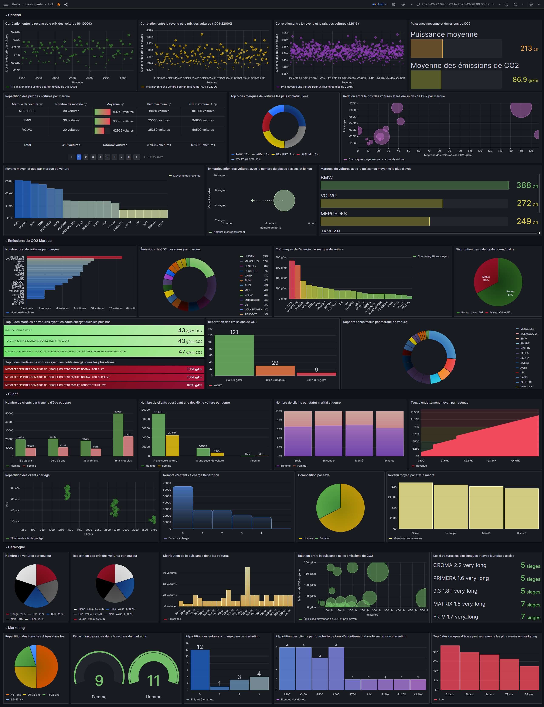

# Analyse de la Clientèle d'un Concessionnaire Automobile pour la Recommandation de Modèles de Véhicules


## Objetifs

Le projet vise à utiliser les connaissances en Big Data, Data Visualization et Machine Learning pour aider un concessionnaire automobile. Les objectifs incluent la recommandation optimale de modèles de véhicules, la catégorisation des véhicules, et la mise en place d'un Data Lake. Il implique également l'utilisation d'Access Drivers, d'un bus de données, d'outils d'analyse, et la création d'un programme Map/Reduce pour adapter un fichier spécifique.

Le projet nécessite l'analyse exploratoire des données, l'identification des catégories de véhicules, la fusion des données clients et immatriculations, et la création d'un modèle de classification. Un rapport détaillé et des scripts sont requis pour documenter les choix, processus et résultats. En résumé, l'objectif est d'optimiser la recommandation de véhicules en utilisant des techniques avancées d'analyse de données.

## Informations
Nom des étudiants :
- AGLAE Sébastien
- BONE Ernesto
- CHIAPPE Mike
- LAPSHINA Valeriia
- VINCENT Yehoudi

Nom des encadrants :
- PASQUIER Nicolas
- MOPOLO Gabriel
- SIMONIAN Sergio
- WINKLER Marco

Tous le projet est hébergé sur 135.181.84.87.

## Acceder aux outils
Voici les outils:
- Grafana
  - [Grafana (TPA Dashboard)](http://135.181.84.87:3000/d/f594fa82-9162-44ab-83be-7cdb84c2fbd5/tpa?orgId=1)
  - [Documentation](./grafana_sql/description.md)
  - [Requêtes SQL](./grafana_sql)
  - Id :
  - Mot de passe :

 
## Techno
Notre stack :
- Postgres
- Mongo
- Sqlite
- Redis
- Spark
- Hive
- Hadoop
- Nats/Jetstream
- Go
- Python
- Grafana

Nos programmes :
- Données API : go, postgres
- Extracteur de données CO2 : python, spark
- Traitement des données : mongo, redis, python, spark, sqlite, nats
- Insertion de données : mongo, redis, hadoop, python, spark
- Connecteur Databus : go, nats/jetstream
- Visualisation Grafana : postgres

## Description de la hierarchie du projet
```bash
.
├── data_api
├── data_extractor
├── data_treater
├── data_upload
├── databus_connector
├── grafana_sql
├── kafka
├── machine_learning
└── sql_script
```
